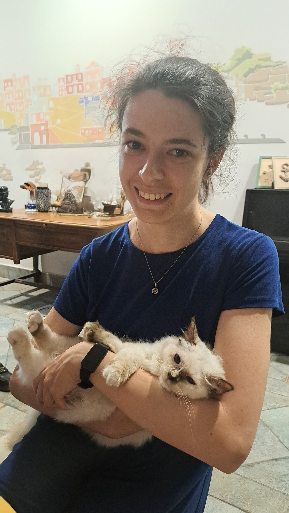

<link rel="stylesheet" href="https://cdnjs.cloudflare.com/ajax/libs/font-awesome/6.5.1/css/all.min.css">

Hi! I am a PhD student in Combinatorics at the [University of Warwick](https://warwick.ac.uk/fac/sci/maths/), under the supervision of [Agelos Georgakopoulos](https://agelos.neocities.org/).

My interests include graph theory and its connections with geometry and topology. My current research focus is coarse graph theory.

Previously, I studied Maths at the [Scuola Normale Superiore](https://www.sns.it/it) in Pisa (Corso Ordinario, equivalent to a second-level master's degree) and at the [University of Pisa](https://www.dm.unipi.it/) (bachelor's and master's degrees).

In a previous life, I worked as a systematic trading strategies developer at Goldman Sachs.

 

---

### Contact

* <i class="fa-solid fa-envelope" style="width: 20px;"></i> [chiara[dot]molinari[dot]maths@gmail[dot]com](mailto:chiara.molinari.maths@gmail.com)
* <i class="fa-brands fa-linkedin" style="width: 20px;"></i> [LinkedIn](https://www.linkedin.com/in/chiara-molinari-4ab532255/)
* <i class="fa-brands fa-github" style="width: 20px;"></i> [GitHub](https://github.com/ChiaraM00)